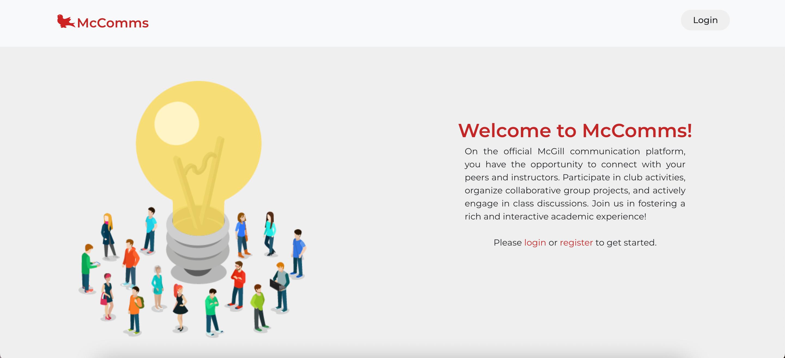

# SOCS-Website-Competition

Steven Kim: Home page, login, registration, user authentication using jwt tokens, setting up frontend, backend and database

Ally Zhang: Discussion board page, creating and deleting boards, logout button

Michael Xi: Sidebar for discussion boards, Sidebar for direct messages,  creating channels, adding members, deleting members, adding friends, linking pages together

Isabella Drouin: Messaging

